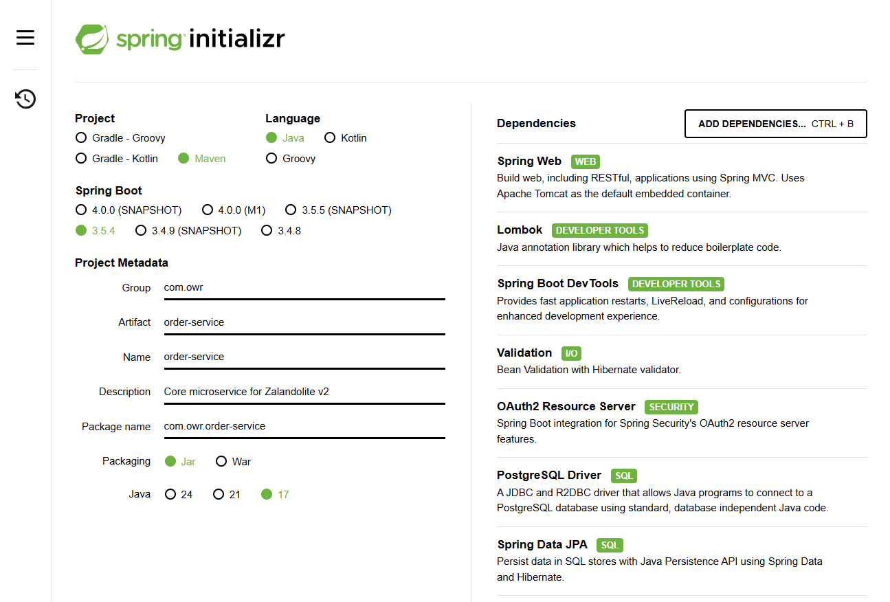
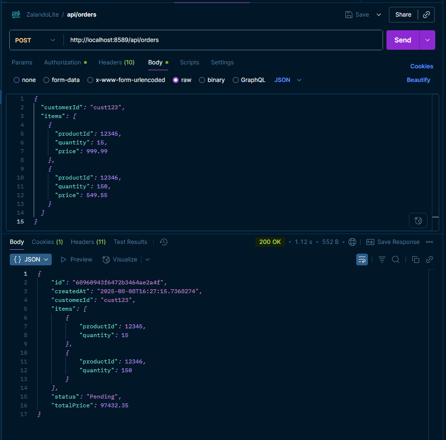
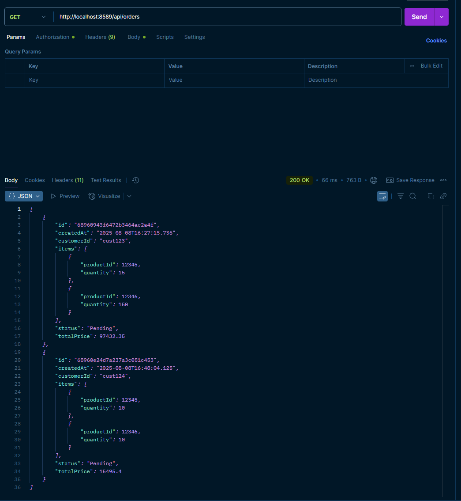

# 🧾 Order Service – ZalandoLite V2 (Microservice 5)

---

###   🔗 [ZalandoLite V2  🍀 Overview Repository ](https://github.com/Ochwada/ZalandoLiteV2-MicroservicesArchitecture)
Microservices ⬇️ part of **ZalandoLite V2**
#### 🖇️ [Microservice 1: Authentication Service](https://github.com/Ochwada/ZalandoLiteV2-authentication)
#### 🖇️ [Microservice 2: Product Service](https://github.com/reyhanovelek/ZalandoLiteV2-product1)
#### 🖇️ [Microservice 3: Inventory Service](https://github.com/Ochwada/ZalandoLiteV2-inventory)
#### 🖇️ [Microservice 5: Order Service](https://github.com/Ochwada/ZalandoLiteV2-order)

---
## 📖 About Order Service

**Order Service** is a core component in the **ZalandoLite V2** backend microservices architecture. It handles the full lifecycle of customer orders — from processing new order requests to validating product availability and storing finalized orders in a PostgreSQL database.

This service interacts directly with the **Inventory Service** to ensure stock validation and maintains reliable, consistent order data using transactional guarantees.

---

## Project spring initialization
### Dependencies
Including the common dependencies ([check here](https://github.com/Ochwada/ZalandoLiteV2-MicroservicesArchitecture)),
some *Unique Dependencies* for this service are:

| Dependency Artifact                          | Purpose                                                                               |
|----------------------------------------------|---------------------------------------------------------------------------------------|
| `spring-boot-starter-data-jpa`               | Persist data in SQL stores with Java Persistence APi using Spring Data and Hibernate. |
| `spring-boot-starter-oauth2-resource-server` | Secures the service by validating and processing OAuth2 JWT access tokens.            |
| `postgresql`                                 | Required at runtime to connect to a PostgreSQL database.                              |

## Features
Building an Order microservice that performs the following responsibilities:
- Process new customer orders
- Validate product availability through the Inventory Service
- Apply business logic (e.g., discounts, taxes)
- Store order records in **PostgreSQL**
- Forward authentication tokens to dependent services

## 🔌 API Endpoints

| Method | Endpoint                    | Description             |
|--------|-----------------------------|-------------------------|
| POST   | `/api/orders`               | Create a new order      |
| GET    | `/api/orders/{orderId}`     | Retrieve order by ID    |
| GET    | `/api/orders/user/{userId}` | List all orders by user |

> ⚠️ All endpoints require a valid JWT for authentication.

## 🔗 Dependencies

This service interacts with:
- **Product Service** – to retrieve product info
- **Inventory Service** – to check and deduct stock
- **Discount Service** – to calculate applicable discounts

## Results
- Place an order

- Retrieve orders

