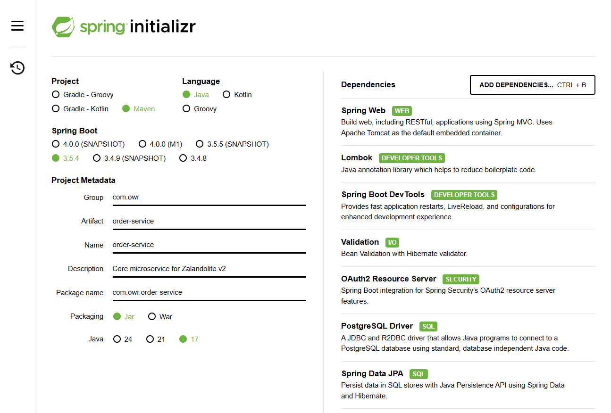

# 🛒 ZalandoLite V2 - Order

---

###   🔗 [ZalandoLite V2  🍀 Overview Repository ](https://github.com/Ochwada/ZalandoLiteV2-MicroservicesArchitecture)
Microservices ⬇️ part of **ZalandoLite V2**
#### 🖇️ [Microservice 1: Authentication Service](https://github.com/Ochwada/ZalandoLiteV2-authentication)
#### 🖇️ [Microservice 2: Product Service](https://github.com/reyhanovelek/ZalandoLiteV2-Product)
#### 🖇️ [Microservice 3: Inventory Service](https://github.com/Ochwada/ZalandoLiteV2-inventory)
#### 🖇️ [Microservice 5: Order Service](https://github.com/Ochwada/ZalandoLiteV2-order)

---

## Project spring initialization

### Dependencies
Including the common dependencies ([check here](https://github.com/Ochwada/ZalandoLiteV2-MicroservicesArchitecture)),
some *Unique Dependencies* for this service are:

| Dependency Artifact                          | Purpose                                                                               |
|----------------------------------------------|---------------------------------------------------------------------------------------|
| `spring-boot-starter-data-jpa`               | Persist data in SQL stores with Java Persistence APi using Spring Data and Hibernate. |
| `spring-boot-starter-oauth2-resource-server` | Secures the service by validating and processing OAuth2 JWT access tokens.            |
| `postgresql`                                 | Required at runtime to connect to a PostgreSQL database.                              |

